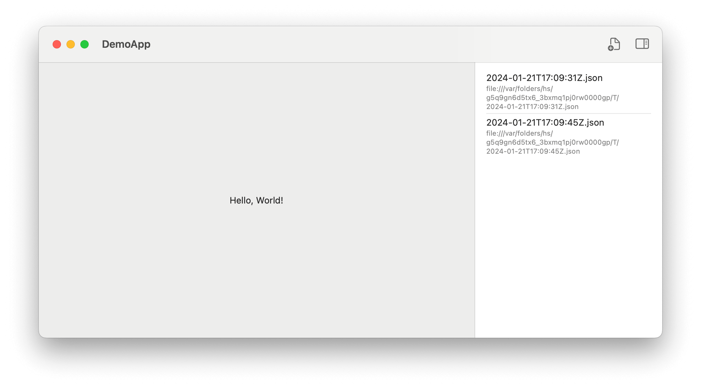
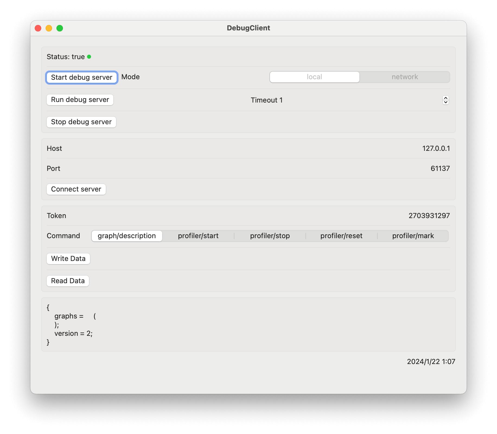

## [WIP] AGDebugKit

A package to get debug information from the private AttributeGraph framework behind SwiftUI.

If you need JSON result visualization, you can refer to [GraphConverter](https://github.com/OpenSwiftUIProject/GraphConverter)

If you need SwiftUI debug information, you can refer to [SwiftUIViewDebug](https://github.com/OpenSwiftUIProject/SwiftUIViewDebug)

Note that only macOS and iPhone simulator are supported for now. And I only tested it on macOS 15.5 and iOS 18.5.

## Example

## Star History

<a href="https://star-history.com/#OpenSwiftUIProject/AGDebugKit&Date">
  <picture>
    <source media="(prefers-color-scheme: dark)" srcset="https://api.star-history.com/svg?repos=OpenSwiftUIProject/AGDebugKit&type=Date&theme=dark" />
    <source media="(prefers-color-scheme: light)" srcset="https://api.star-history.com/svg?repos=OpenSwiftUIProject/AGDebugKit&type=Date" />
    
  </picture>
</a>
