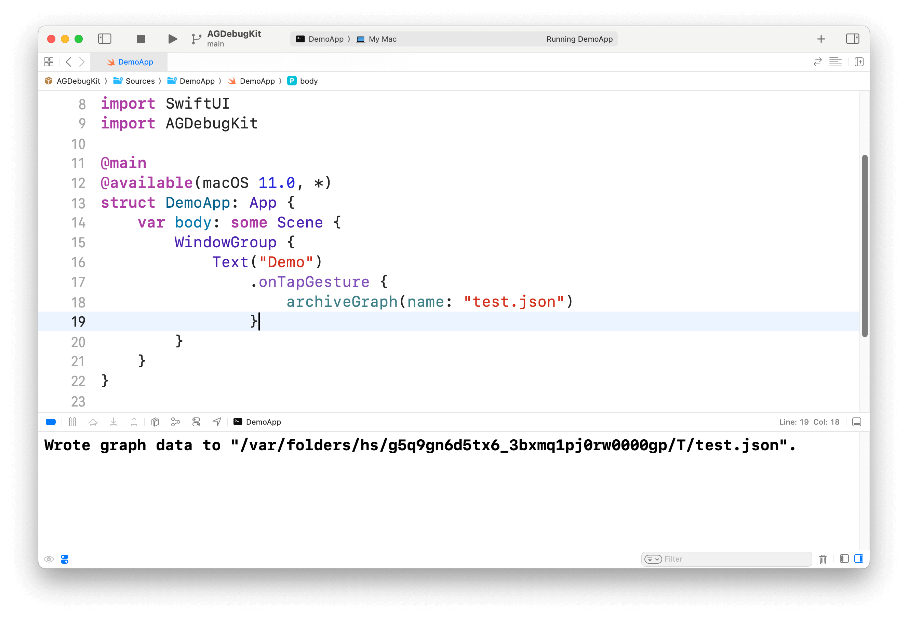

## [WIP] AGDebugKit

A package to get debug information from the private AttributeGraph framework behind SwiftUI.

If you need JSON result visualization, you can refer to [GraphConverter](https://github.com/OpenSwiftUIProject/GraphConverter)

If you need SwiftUI debug information, you can refer to [SwiftUIViewDebug](https://github.com/OpenSwiftUIProject/SwiftUIViewDebug)

## Example

