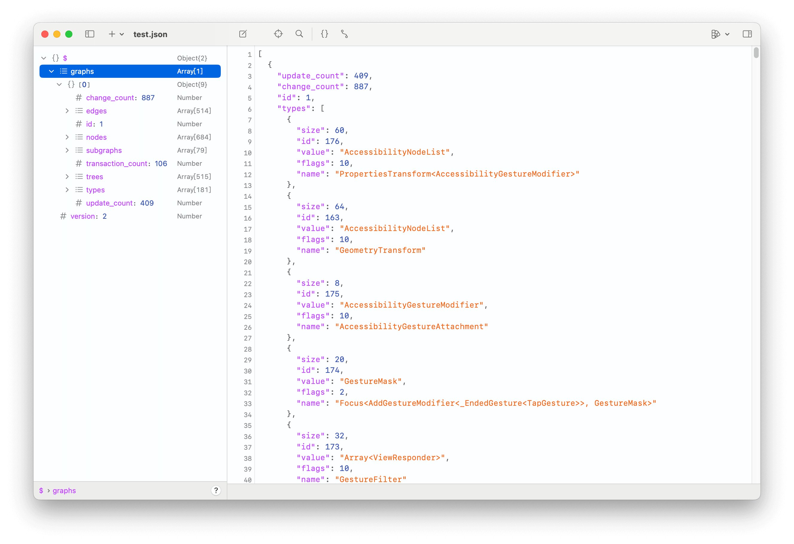

## [WIP] AGDebugKit

A package to get debug information from the private AttributeGraph framework behind SwiftUI.

For SwiftUI debug information, see [SwiftUIViewDebug](https://github.com/OpenSwiftUIProject/SwiftUIViewDebug)

- [ ] AGDescriptionFormat
- [ ] AGGraphGetAttributeGraph
- [ ] AGGraphDescription
- [ ] AGGraphCreate
- [ ] AGDebugServer

## Example

